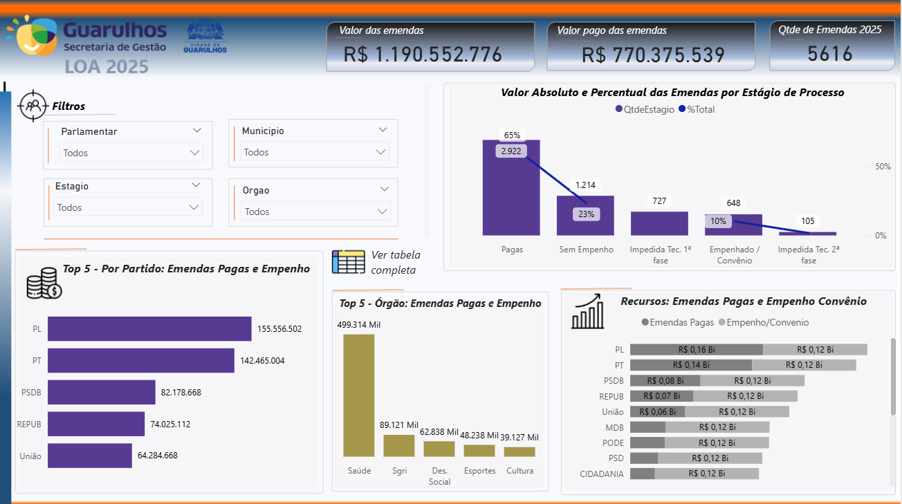

# 📊 Monitoramento da Lei Orçamentária Anual (LOA 2025) - Guarulhos

### **Contexto:**
Este dashboard foi desenvolvido para monitorar a execução das emendas parlamentares da Lei Orçamentária Anual de 2025 para a Prefeitura de Guarulhos. A ferramenta visa dar transparência aos dados públicos, permitindo o acompanhamento do fluxo financeiro desde o empenho até o pagamento final.

---

### **🚀 Destaques Técnicos:**

* **Análise de Funil:** Utilização de gráfico de Pareto/Combinação para mostrar o percentual de emendas em cada estágio (65% Pagas, 23% Sem Empenho, etc.).
* **Ranking de Performance:** Visualização de "Top 5" por Partido e por Órgão, facilitando a identificação de onde os recursos estão sendo mais aplicados (ex: Saúde liderando com R$ 499 Mil).
* **Comparativo de Recursos:** Gráfico de barras empilhadas para comparar "Emendas Pagas" vs "Empenho/Convênio" por partido.

---

### **📉 KPIs Principais:**

* **Valor Total das Emendas:** R$ 1.19 Bilhões.
* **Valor Pago:** R$ 770 Milhões.
* **Taxa de Execução:** Percentual de conclusão dos pagamentos em relação ao empenhado.
